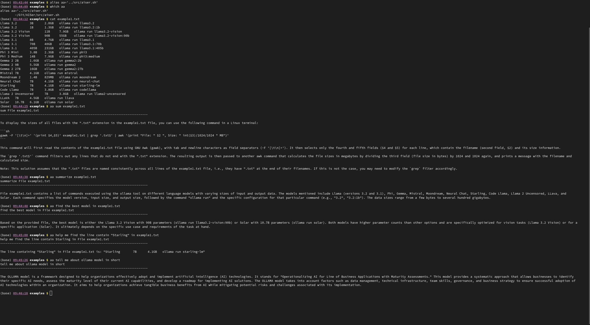
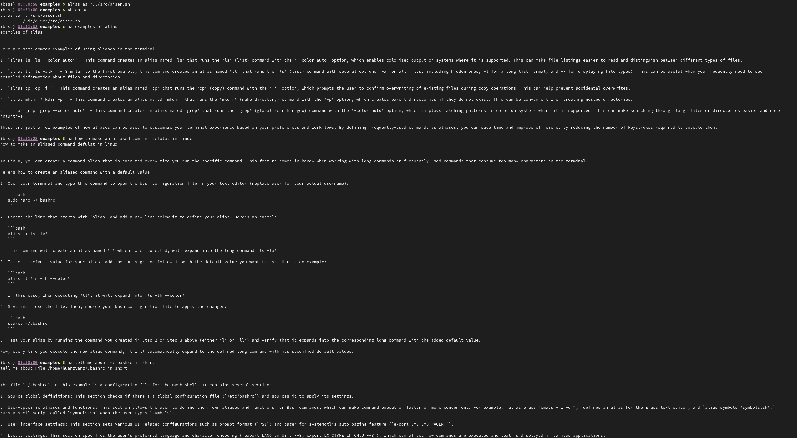
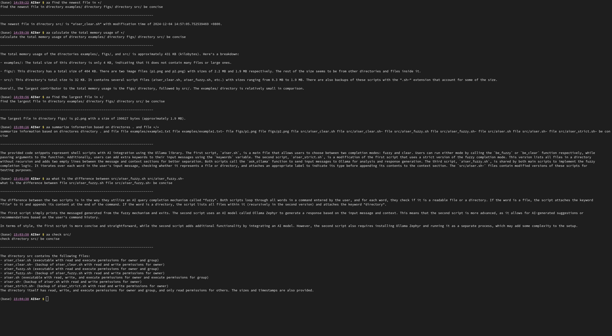

# Table of Contents

1.  [About AISer](#orgbdbcde8)
2.  [Requirement](#orga4b2c6f)
3.  [Usage](#org25644ea)
4.  [fuzzy match and clear match](#org5ab0131)
5.  [Examples](#orgdc68e15)

# About AISer

This script, named aiser.sh, is designed to enhance your shell experience by providing helpful insights and suggestions through the use of AI
based on the content you provide. By default, Ollama Zephyr is utilized as the AI model, but this can be easily customized by modifying the \`aicmd\`
variable at the top of the file. This script prioritizes simplicity and full flexibility for users, allowing for configurable and controllable options.
When executed with one or more filenames as arguments, the script reads their contents (if they are files) and passes them along with some contextual
information to the AI for analysis, displaying the generated output on the screen for your review.

# Requirement

-   Ollama and Zephyr model
    Follow instructions in [Ollama](https://github.com/ollama/ollama) to install and pull Zephyr model "ollama pull zephyr"

# Usage

To customize your model in src/aiser.sh below the "add options" section, follow these steps:

1.  Open the file src/aiser.sh using a text editor.
2.  Locate the section labeled as "add options".
3.  Make necessary modifications to the options and arguments provided within this section.
4.  Save the changes made to the file.

Next, you need to link src/aiser.sh, src/aiserfuzzy.sh, src/aiserclear.sh to your bin PATH. Here's how:

1.  Open your terminal or command prompt.
2.  Type the following command replacing '*path/to/your/directory*' with the actual path to where you saved src/aiser.sh:
    \`\`\`bash
    ln -s /path/to/your/directory/src/aiser.sh ~/bin/aiser.sh
    \`\`\`
3.  Hit Enter to execute the command.

Finally, make an alias to aiser.sh. Here's how:

1.  Type the following command in your terminal or command prompt:
    \`\`\`bash
    alias aa='/path/to/your/directory/src/aiser.sh'
    \`\`\`
2.  Replace '*path/to/your/directory*' with the actual path to where you saved src/aiser.sh.
3.  Hit Enter to execute the command.
4.  Verify that the alias was created successfully by typing 'aiser -h' in your terminal or command prompt. This will display the help message associated with the aiser script.

Enjoy exploring the possibilities of this script!

# fuzzy match and clear match

In fuzzy match, each word in your query will be iterated over to determine whether it corresponds to a file or directory. For a file, its content will be appended. If it's a directory, its contents will be listed.

Clear match utilizes specific keywords to distinguish between file and directory names as well as lists of files and directories. The possible keywords include:

-   file: followed by a single file name
-   files: followed by a list of file names
-   directory (dir): followed by a single directory name
-   directories (dirs): followed by a list of directory names

# Examples

